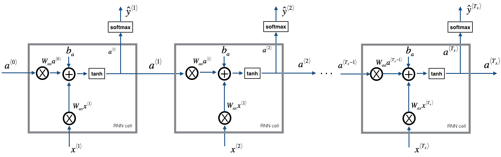
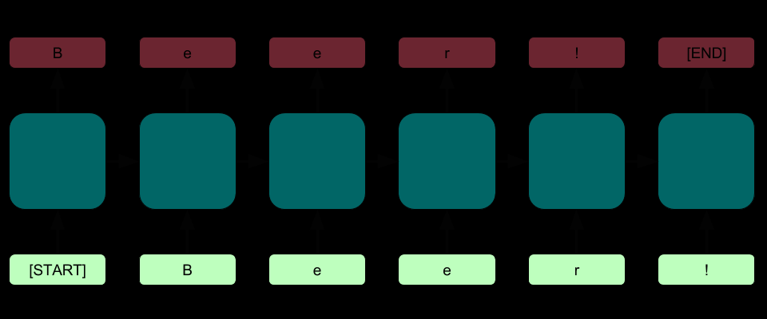

  # Name Generation Model - RNN 📝  
  A Recurrent Neural Network Model that generates human names based on existing data. The entire model is implemented using Tensorflow library.
  This was implemented during the month long competition WOC 6.0 conducted by Microsoft Student Technical Club

  ## Prerequisites 🚀  
  Both to be installed with pip
  1. Numpy
  2. Tensorflow

  ##  Overview of the Model🔥  
  The model is a character level neural network. Instead of generating a new word based on the previous word, it generates a character. The model will have the following structure:
  * Initialize the parameters 
  * Run the optimization loop
    * Forward propogation to compute the loss function
    * Backward propogation to compute gradients
    * Clipping gradients to avoid gradient exploding
    * Using gradients, updating the parameters using gradient descent
  * Return the learned parameters and predict the names

  ## Visualization
  
  

  ## References

  1. https://github.com/chaitanyarahalkar/Name-Generator-RNN
  2. WOC 6.0 Documentation
  3. https://towardsdatascience.com/recurrent-neural-networks-rnns-3f06d7653a85